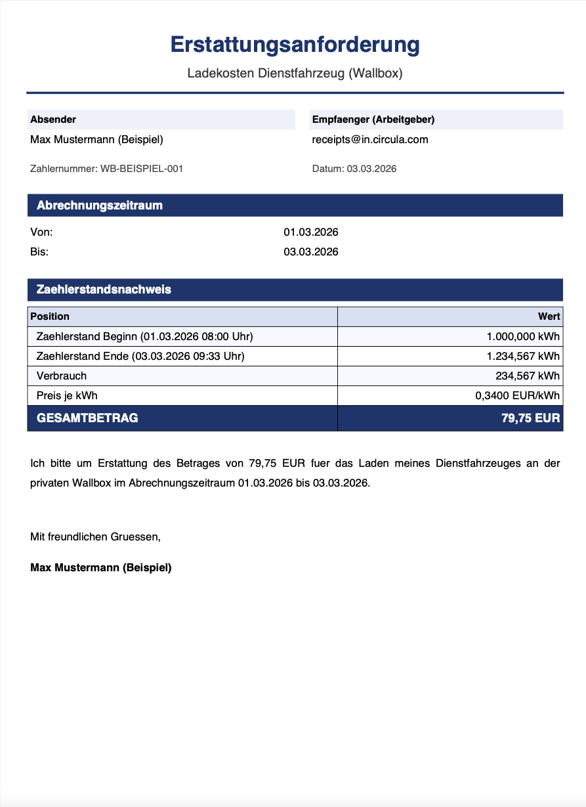
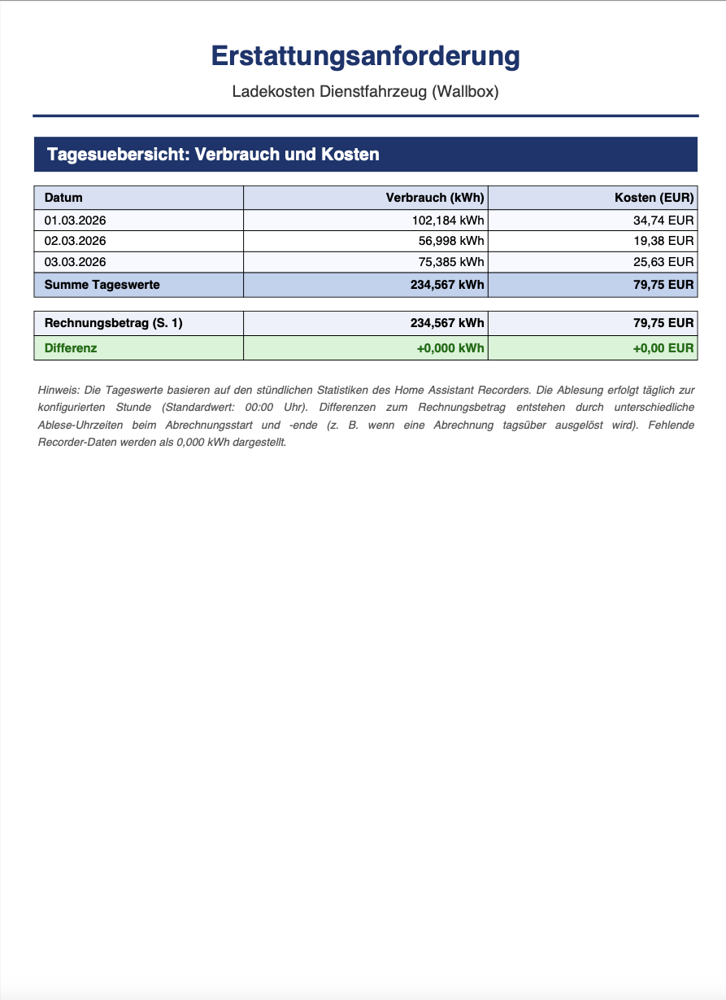

# Wallbox Abrechnung

[](https://github.com/Feberdin/ha-wallbox-billing/releases)
[](https://hacs.xyz)
[](https://www.home-assistant.io)
[](LICENSE)

Eine Home Assistant Custom Integration zur automatischen Erstellung und dem Versand von monatlichen **Erstattungsanforderungen** für Ladekosten des Dienstfahrzeuges an der privaten Wallbox.

Die Integration erstellt ein professionelles **PDF-Dokument** mit allen relevanten Daten und versendet es direkt per E-Mail an den Arbeitgeber.

**Rechnungsbeispiel (Vorschau):**

<p align="center">
  
  
</p>

---

## Inhaltsverzeichnis

- [Features](#features)
- [Beispielausgabe](#beispielausgabe)
- [Hardware](#hardware)
  - [Eltako DSZ15D Energiezähler](#eltako-dsz15d-energiezähler)
  - [ESP32 Mikrocontroller](#esp32-mikrocontroller)
  - [Verdrahtung S0-Schnittstelle](#verdrahtung-s0-schnittstelle)
- [Installation](#installation)
- [Einrichtung](#einrichtung)
- [E-Mail-Konfiguration](#e-mail-konfiguration)
  - [Gmail App-Passwort erstellen](#gmail-app-passwort-erstellen)
  - [SMTP-Übersicht aller Anbieter](#smtp-übersicht-aller-anbieter)
- [Automationen](#automationen)
  - [Monatlicher automatischer Versand](#monatlicher-automatischer-versand)
  - [Benachrichtigung nach Versand](#benachrichtigung-nach-versand)
- [Buttons & manueller Versand](#buttons--manueller-versand)
- [Sensoren](#sensoren)
- [Einstellungen nachträglich ändern](#einstellungen-nachträglich-ändern)
- [ESPHome-Firmware](#esphome-firmware)

---

## Features

- **PDF-Rechnung** auf Knopfdruck oder per Automation mit:
  - Name, Zählernummer, Abrechnungszeitraum
  - Zählerstand zu Beginn und Ende des Zeitraums (mit exakter Uhrzeit)
  - Verbrauch in kWh
  - Strompreis je kWh
  - Gesamtbetrag in EUR
  - **Optionale 2. Seite** mit Tagesübersicht (kWh und EUR pro Tag, Plausibilitätsprüfung)
- Versand per **E-Mail** (SMTP) mit PDF als Anhang und HTML-Zusammenfassung im E-Mail-Text
- **Monatliche Automation** möglich (Service `wallbox_billing.send_invoice`)
- **3 Buttons**: Abrechnung senden, Test-Rechnung (kein State-Update), Beispiel-PDF
- **4 Sensoren** für aktuellen Verbrauch, Kosten, letztes Abrechnungsdatum und Zählerstand
- Alle Einstellungen jederzeit über die HA-Oberfläche änderbar
- Persistente Speicherung des letzten Zählerstandes über HA-Neustarts hinweg

---

## Beispielausgabe

Eine echte Beispielausgabe (inkl. Tagesübersicht auf Seite 2) findest du hier:

- [Beispiel-WallboxAbrechnung-mit-Tagesausgabe.pdf](docs/examples/Beispiel-WallboxAbrechnung-mit-Tagesausgabe.pdf)

Die Ausgabe ist repräsentativ für den Versand über den Button **„Beispiel-PDF senden“**.

---

## Hardware

### Eltako DSZ15D Energiezähler

> 🛒 **Bei Amazon kaufen:** [Eltako DSZ15D-3x80A Drehstromzähler](https://amzn.to/46B2tcv)
> *(Affiliate-Link – beim Kauf über diesen Link unterstützt du das Projekt ohne Mehrkosten)*

Der **Eltako DSZ15D-3x80A** ist ein MID-geeichter Drehstromzähler mit S0-Schnittstelle, ideal für die Erfassung von Wallbox-Ladeenergie.

📄 **[Bedienungsanleitung & Datenblatt (PDF, Eltako)](https://www.eltako.com/fileadmin/downloads/de/_bedienung/DSZ15D-3x80A_28380015-1_dt.pdf)**

#### Technische Daten (aus Datenblatt)

| Eigenschaft | Wert |
|-------------|------|
| Betriebsspannung | 3×230/400 V, 50 Hz |
| Maximalstrom | 3×80 A |
| Referenzstrom I_ref | 3×0,5–10 (80) A |
| Anlaufstrom | 40 mA |
| Genauigkeitsklasse | B (±1 %) |
| Eigenverbrauch | 0,5 W je Pfad |
| Anzeige | LC-Display, 7 Stellen |
| Betriebstemperatur | −25 °C bis +55 °C |
| Schutzart | IP50 (Einbau in IP51-Schrank) |
| Abmessungen | 4 TE = 70 mm breit, 58 mm tief (DIN-EN 60715 TH35) |
| MID-geeicht | ✅ (EG-Baumusterprüfbescheinigung 0120/SGS0204) |

#### S0-Schnittstelle

| Eigenschaft | Wert |
|-------------|------|
| Norm | DIN EN 62053-31 |
| Ausführung | Potenzialfrei (Optokoppler) |
| Spannung | min. 5 V DC, max. 30 V DC |
| Strom | max. 20 mA |
| Impedanz | 100 Ω |
| Impulslänge | 30 ms |
| **Impulse** | **1.000 Imp./kWh** |
| Klemmen | SO+ und SO− |

#### Anschlussplan (4-Leiter 3×230/400 V)

```
          SO-Ausgang
           +    −
           |    |
 N   E1  E2  SO+ SO−
 |    |    |    |    |
 └────┴────┴────┴────┘   (Oberklemmen)
      [  DSZ15D Display  ]

 ↑L1  ↓L1  ↑L2  ↓L2  ↑L3  ↓L3
  |    |    |    |    |    |
 L1───────  L2───────  L3───────
```

> **Wichtig:** Installation nur durch eine Elektrofachkraft! Falsche Verdrahtung kann zu Brandgefahr oder elektrischen Schlägen führen.

Die SO+ und SO−-Klemmen werden mit dem ESP32 (GPIO14) verbunden – entweder direkt oder über einen Pull-up-Widerstand (je nach Spannungspegel).

---

### ESP32 Mikrocontroller

> 🛒 **Bei Amazon kaufen:** [ESP32 Entwicklungsboard](https://amzn.to/4cpUNO0)
> *(Affiliate-Link – beim Kauf über diesen Link unterstützt du das Projekt ohne Mehrkosten)*

Als Mikrocontroller wird ein handelsübliches **ESP32-Entwicklungsboard** (esp32dev) mit [ESPHome](https://esphome.io) verwendet. Der ESP32 zählt die S0-Impulse des DSZ15D, integriert den Energieverbrauch und stellt den Zählerstand als Sensor in Home Assistant bereit.

---

### Verdrahtung S0-Schnittstelle

Eine ausführliche Anleitung zur Verdrahtung des S0-Ausgangs eines Stromzählers an einen ESP-Mikrocontroller (inkl. Schaltplan und ESPHome-Konfiguration) findest du hier:

📖 **[S0-Pulse eines Stromzählers zählen – simon42 Community](https://community.simon42.com/t/s0-pulse-eines-stromzaehlers-zaehlen-konfigruation-esp8266/13508)**

**Kurzübersicht der Verbindung:**

| DSZ15D Klemme | ESP32 Pin | Hinweis |
|---------------|-----------|---------|
| SO+ | 3,3 V oder GPIO (mit Pull-up) | Plusseite des Optokopplers |
| SO− | GPIO14 | Impulseingang |
| – | GND | Gemeinsame Masse |

> Die ESPHome-Konfiguration (Pulse Counter, 1000 Imp./kWh, GPIO14) liegt im Repository unter [`esphome/wallbox.yaml`](esphome/wallbox.yaml).

---

## Installation

### Via HACS (empfohlen)

1. **HACS** → Integrationen → Menü (⋮) oben rechts → **Benutzerdefinierte Repositories**
2. URL eingeben: `https://github.com/Feberdin/ha-wallbox-billing`
3. Kategorie: **Integration** → Hinzufügen
4. Integration in der Liste suchen und **Herunterladen**
5. Home Assistant **neu starten**

### Manuell

1. Den Ordner `custom_components/wallbox_billing/` in dein HA-Konfigurationsverzeichnis kopieren (neben `configuration.yaml`)
2. Home Assistant **neu starten**

---

## Einrichtung

1. **Einstellungen → Integrationen → + Integration hinzufügen**
2. Nach **„Wallbox Abrechnung"** suchen und auswählen

### Schritt 1 – Grundeinstellungen

| Feld | Beschreibung | Beispiel |
|------|-------------|---------|
| Energiesensor | ESPHome-Sensor mit dem Zählerstand | `sensor.esp32_wallbox_wallbox_zahlerstand` |
| Dein Name | Wird auf der PDF als Absender angezeigt | `Max Mustermann` |
| Zählernummer | Seriennummer des Energiezählers | `DSZ15D-001` |
| Strompreis (€/kWh) | Aktueller Hausstrompreis | `0,3400` |
| Startwert (kWh) | Zählerstand der **letzten** Abrechnung | `4523,456` |
| Startdatum | Datum der letzten Abrechnung | `01.02.2026` |

### Schritt 2 – E-Mail / SMTP

| Feld | Beschreibung |
|------|-------------|
| Empfänger-E-Mail | E-Mail-Adresse des Arbeitgebers |
| SMTP-Host | Mailserver deines E-Mail-Anbieters |
| Port | Meist 587 (TLS) oder 465 (SSL) |
| Absender-E-Mail | Deine E-Mail-Adresse |
| Benutzername | Deine E-Mail-Adresse (oder leer lassen) |
| Passwort | Dein Passwort oder App-Passwort |
| TLS | Bei Port 587: **Ein** |
| SSL | Bei Port 465: **Ein** |

> Alle Einstellungen können jederzeit unter **Einstellungen → Integrationen → Wallbox Abrechnung → Konfigurieren** geändert werden.

---

## E-Mail-Konfiguration

### Gmail App-Passwort erstellen

Google lässt für externe Apps wie Home Assistant kein normales Google-Passwort zu. Stattdessen wird ein **App-Passwort** benötigt.

**Voraussetzung:** 2-Faktor-Authentifizierung muss bei Google aktiviert sein.

**Schritt-für-Schritt:**

1. Gehe zu [myaccount.google.com/apppasswords](https://myaccount.google.com/apppasswords)
   *(du musst in deinem Google-Konto eingeloggt sein)*

2. Klicke auf **„App-Passwort erstellen"**

3. Gib einen beliebigen Namen ein, z. B. `Home Assistant Wallbox`

4. Klicke auf **„Erstellen"**

5. Du bekommst ein **16-stelliges Passwort** angezeigt (Format: `xxxx xxxx xxxx xxxx`)

6. Kopiere dieses Passwort und trage es in der Integration unter **Passwort** ein
   *(Leerzeichen werden beim Einfügen automatisch ignoriert)*

**Gmail SMTP-Einstellungen:**

| Feld | Wert |
|------|------|
| SMTP-Host | `smtp.gmail.com` |
| Port | `587` |
| TLS | **Ein** |
| SSL | **Aus** |
| Benutzername | deine vollständige Gmail-Adresse |
| Passwort | das 16-stellige App-Passwort |

> **Hinweis:** Das App-Passwort gilt nur für diese eine Anwendung und kann jederzeit unter [myaccount.google.com/apppasswords](https://myaccount.google.com/apppasswords) widerrufen werden.

---

### SMTP-Übersicht aller Anbieter

| Anbieter | Host | Port | TLS | SSL | Hinweis |
|----------|------|------|:---:|:---:|---------|
| **Gmail** | `smtp.gmail.com` | `587` | ✅ | ❌ | App-Passwort erforderlich |
| **Gmail (SSL)** | `smtp.gmail.com` | `465` | ❌ | ✅ | App-Passwort erforderlich |
| **GMX** | `mail.gmx.net` | `587` | ✅ | ❌ | Normales Passwort |
| **Web.de** | `smtp.web.de` | `587` | ✅ | ❌ | Normales Passwort |
| **T-Online** | `securesmtp.t-online.de` | `587` | ✅ | ❌ | Normales Passwort |
| **iCloud** | `smtp.mail.me.com` | `587` | ✅ | ❌ | App-Passwort erforderlich |
| **Outlook.com** | `smtp-mail.outlook.com` | `587` | ✅ | ❌ | Nur private Konten ohne 2FA |

> **Outlook / Microsoft 365:** Microsoft hat Basic-Authentifizierung für persönliche Microsoft 365-Konten seit September 2024 deaktiviert. Für private Outlook.com-Konten ohne 2FA kann es noch funktionieren. Empfehlung: Gmail oder GMX verwenden.

---

## Automationen

### Monatlicher automatischer Versand

Diese Automation sendet die Abrechnung automatisch am **1. jeden Monats um 08:00 Uhr**.

**Einrichten:** Einstellungen → Automationen → **+ Neu erstellen** → oben rechts **YAML bearbeiten** → folgenden Code einfügen:

```yaml
alias: "Wallbox Abrechnung – Monatlich senden"
description: "Erstellt und sendet am 1. jeden Monats die Wallbox-Abrechnung per E-Mail"
trigger:
  - platform: time
    at: "08:00:00"
condition:
  - condition: template
    value_template: "{{ now().day == 1 }}"
action:
  - service: wallbox_billing.send_invoice
    data: {}
mode: single
```

> **Tipp:** Die Uhrzeit (`08:00:00`) kann beliebig angepasst werden.

---

### Benachrichtigung nach Versand

Die Integration feuert nach jedem erfolgreichen Versand das Event `wallbox_billing_invoice_sent`. Diese Automation zeigt daraufhin eine Benachrichtigung an – egal ob der Versand durch die monatliche Automation oder durch manuellen Button-Klick ausgelöst wurde.

#### Variante A – Benachrichtigung in der HA-Oberfläche

```yaml
alias: "Wallbox Abrechnung – Benachrichtigung"
description: "Zeigt eine Meldung in Home Assistant an wenn die Abrechnung versendet wurde"
trigger:
  - platform: event
    event_type: wallbox_billing_invoice_sent
action:
  - service: notify.persistent_notification
    data:
      title: "Wallbox Abrechnung versendet"
      message: "Die monatliche Erstattungsanforderung wurde erfolgreich per E-Mail gesendet."
mode: single
```

#### Variante B – Push-Benachrichtigung auf das Smartphone

Voraussetzung: [Home Assistant Companion App](https://companion.home-assistant.io) auf dem Smartphone installiert.

```yaml
alias: "Wallbox Abrechnung – Push-Benachrichtigung"
description: "Sendet eine Push-Nachricht aufs Handy wenn die Abrechnung versendet wurde"
trigger:
  - platform: event
    event_type: wallbox_billing_invoice_sent
action:
  - service: notify.mobile_app_DEIN_GERÄTENAME
    data:
      title: "Wallbox Abrechnung versendet"
      message: "Die Erstattungsanforderung wurde erfolgreich per E-Mail gesendet."
mode: single
```

> Den genauen Gerätenamen findest du unter: **Einstellungen → Integrationen → Companion App → Benachrichtigungen**.
> Ersetze `DEIN_GERÄTENAME` durch den dort angezeigten Namen (z. B. `notify.mobile_app_iphone_von_max`).

---

## Buttons & manueller Versand

In Home Assistant erscheint nach der Einrichtung das Gerät **„Wallbox Abrechnung"** mit drei Buttons:

| Button | Funktion |
|--------|----------|
| **Rechnung erstellen & senden** | Erstellt die PDF mit echten aktuellen Werten und sendet sie per E-Mail. Speichert anschließend den aktuellen Zählerstand als neuen Startwert. |
| **Test-Rechnung senden** | Erstellt und sendet die PDF mit echten Werten (Subject: „TEST: …"), **ohne** Zählerstand oder Datum zu ändern. Ideal zum Testen der E-Mail-Zustellung und des PDF-Layouts. |
| **Beispiel-PDF senden** | Generiert eine PDF mit Dummy-Daten (Max Mustermann, fiktive Verbrauchswerte) und sendet sie an die konfigurierte E-Mail. Nützlich zur Überprüfung des PDF-Layouts ohne echte Daten. |

> **Wichtig:** Nach dem echten Versand (Button oder Automation) wird der aktuelle Zählerstand automatisch als neuer Startwert für den nächsten Abrechnungszeitraum gespeichert. Test- und Beispiel-Buttons ändern keine Werte.

---

## Sensoren

| Sensor | Einheit | Beschreibung |
|--------|---------|-------------|
| `sensor.wallbox_abrechnung_verbrauch_seit_letzter_abrechnung` | kWh | Verbrauch seit letzter Abrechnung |
| `sensor.wallbox_abrechnung_kosten_seit_letzter_abrechnung` | EUR | Kosten seit letzter Abrechnung |
| `sensor.wallbox_abrechnung_letzte_abrechnung` | Datum | Datum der letzten Abrechnung |
| `sensor.wallbox_abrechnung_zahlerstand_letzte_abrechnung` | kWh | Zählerstand bei letzter Abrechnung |

---

## Einstellungen nachträglich ändern

Alle Einstellungen (Strompreis, Empfänger-E-Mail, SMTP-Daten, Name, Zählernummer, Tagesübersicht) können jederzeit geändert werden:

**Einstellungen → Integrationen → Wallbox Abrechnung → Konfigurieren**

Dort sind auch die neuen Optionen für die Tagesübersicht verfügbar:

| Option | Standard | Beschreibung |
|--------|----------|-------------|
| Tagesübersicht im PDF anhängen | **Ein** | Fügt eine 2. PDF-Seite mit Tagesverbrauch und -kosten aus dem HA Recorder hinzu |
| Ablesezeit Recorder (Stunde) | **0** | Stunde (0–23), zu der täglich der Zählerstand aus dem Recorder abgelesen wird (0 = Mitternacht) |

---

## ESPHome-Firmware

Die ESPHome-Konfiguration für den ESP32 liegt unter [`esphome/wallbox.yaml`](esphome/wallbox.yaml).

**Zählerstand manuell setzen** (z. B. nach Anbieterwechsel oder Gerätetausch):

In Home Assistant unter dem ESP32-Gerät → Zahl **„Wallbox Zählerstand setzen"** → gewünschten Wert eingeben.

---

*Entwickelt für Home Assistant mit ESPHome + Eltako DSZ15D über S0-Schnittstelle.*

> **Affiliate-Hinweis:** Die mit 🛒 gekennzeichneten Links sind Amazon Affiliate-Links. Beim Kauf über diese Links erhalte ich eine kleine Provision ohne Mehrkosten für dich. Danke für deine Unterstützung!
